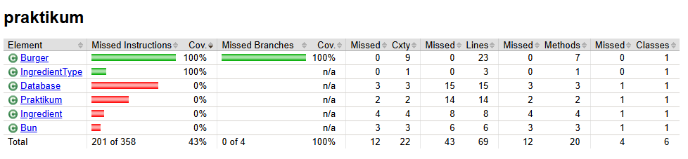

# Дипломная работа. Задание 1: Юнит-тесты

Код классов, содержащих бизнес логику, предоставлен в рамках задания.  

Нужно протестировать программу, которая помогает заказать бургер в [Stellar Burgers](https://stellarburgers.education-services.ru/). Нужно добиться 100% покрытия юнит-тестами класса `Burger`. 
Необходимо использовать моки, стабы и параметризацию. 

## Использовала
- JUnit 4
- Mockito
- JaCoCo
- Windows 11 Pro

## Сделала
- 2 тестовых класса, один из которых параметризованный.
- Все тесты имеют аннотацию Description.
- Использовала Моки и Стабы для подмены зависимостей.

# Результат
Было написано два класса (один из них параметризованный), тестирующих класс Burger.  
Удалось достигнуть 100% покрытия тестируемого класса. Добавлены проверки пограничных кейсов и возможных исключений.
  
Прочие классы, по заданию, покрывать тестами не требуется.  

## Просмотр результатов JaCoCo
Для отображения покрытия проекта тестами используется JaCoCo.  
К проекту приложен результат проверки покрытия. Для его просмотра вызовите  
`start target/site/jacoco/index.html`  
в консоли.
